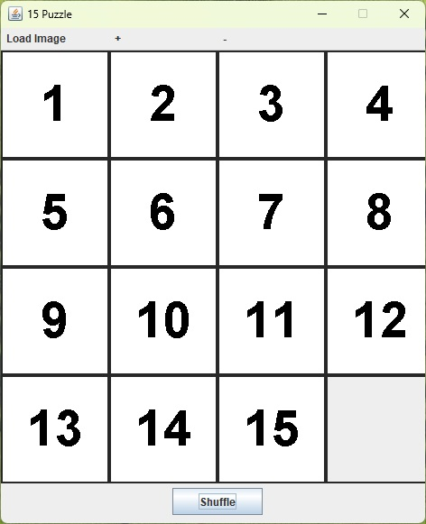
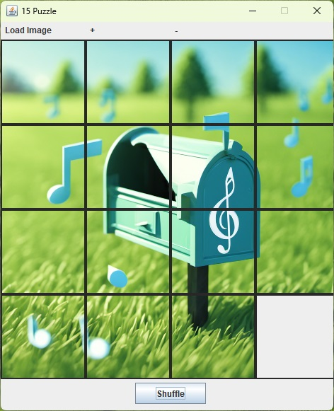
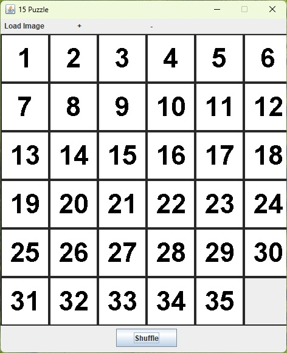

This "for-fun" replica of the 15 Game gives the possibility to play using an image, by loading it from the pc, instead of the classic 15 numbers, giving a more "puzzly" flavour.

        

It is also possible to increment or decrement the table size, by pressing the "+" and "-" buttons.

The project is realized using a simple MVC pattern and Java Swing framework.
